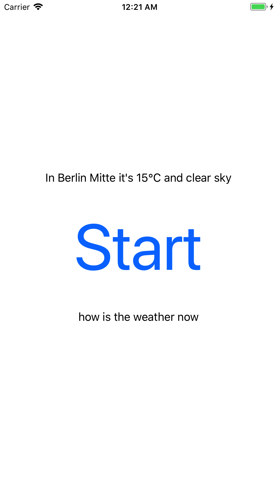

# Setup instructions
This project was developed with MacOS Sierra and Xcode 9.2. UI is optimized only for iPhone 8 Plus.

The following tools are needed in order to build and run the project: 'Carthage', 'git-crypt'
All these tools are installable via Homebrew.

```bash
brew install carthage git-crypt
```

After cloning the project you need to decrypt the included api keys with the symmetric key you have been provided by mail:
```bash
cd /path/to/cloned/repo/
git-crypt unlock /path/to/key
```

Additionaly you need to download and build all carthage dependencies with:
```bash
carthage bootstrap --platform ios
```

_The "VisualRecognitionV3" sub dependency throws an error when building, because IBM f***ed up the latest version. But it's not needed to build the project._

Now you're ready to build and run the app on a connected iPhone or simulator.

# Usage

The ussage of the app is intuitive, but without fancy UI.

Tapping on "Start" starts the voice recognition. While recording audio, the recognized text is shown below the button (after processing in the Watson cloud). If the recognized speech contains the word "weather", a text with the weather of the current location (if location service was allowed by the user previously) is shown above the botton.

Tapping on "Stop" will stop the voice recognition.



# iOS Coding Challenge
We want to know how you write **code** - we don't care about coding challenges where you have to reimplement the HTTP protocol by using the bare basics, we want to know how you can use the existing libraries to solve the problems that we have to solve.

Your task is to create a very small iOS application (written in Swift) which will listen to a voice of the user and will tell them the current weather information when asked for. It's up to you to decide how exactly you want to approach this challenge - do you want to use the native iOS SDKs for voice recognition, use offline voice recognition for keywords (e.g. PocketSphinx) or another online service with conversational capabilities (e.g. api.ai, Microsoft LUIS, etc.). You can also choose whichever weather service you want.

## What we'll look at
- Structure of the code - how you use controllers, services, views. Keep it clean and reusable.
- Code formatting, included unit and UI tests.
- Using external APIs is cool, but you have to make sure the app will support errors if the API is down.
- Readme - we don't need documentation, but a small file explaining how to run the project will be useful.
- Overall user experience in the application.

## Time limit
It should take you between 4 to 8 hours to finish this task. If it takes you longer, it's okay to leave TODOs in the code, just provide an explanation what you would still finish there.

After sending the challenge we'll wait 2 weeks to hear back from you. Feel free to ask us for any clarification if you need it.

## Process
When you're ready, please fork this repository and start writing code in your fork. You'll get extra points for committing often in small chunks, so we'll see the process of how you created the application.

